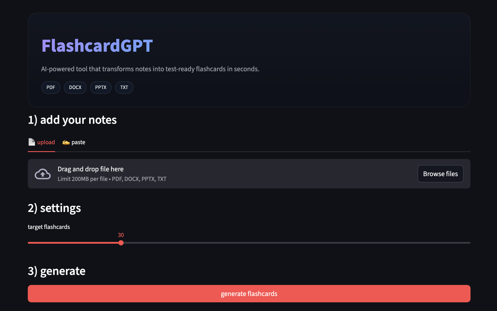

# AI Flashcard Generator (Streamlit + OpenAI)

Turn your notes (PDF/DOCX/TXT or pasted text) into **high‑quality Q/A flashcards** you can edit and export to CSV/Anki.



## Features
- Upload **PDF/DOCX/TXT** or paste text
- Live **character + token** estimate
- **Smart chunking** (~1200–1600 tokens, 150‑token overlap)
- LLM card generation with **guardrails** (answers only from notes)
- Inline **review & edit** table
- Export to **CSV** (front,back) or **Anki TXT** (tab‑separated)
- Session state + **Clear** button
- Dark theme UI

## Quickstart

```bash
python -m venv .venv
source .venv/bin/activate   # windows: .venv\Scripts\activate
pip install -r requirements.txt
export OPENAI_API_KEY="YOUR_KEY"  # windows: set OPENAI_API_KEY=YOUR_KEY
streamlit run app.py